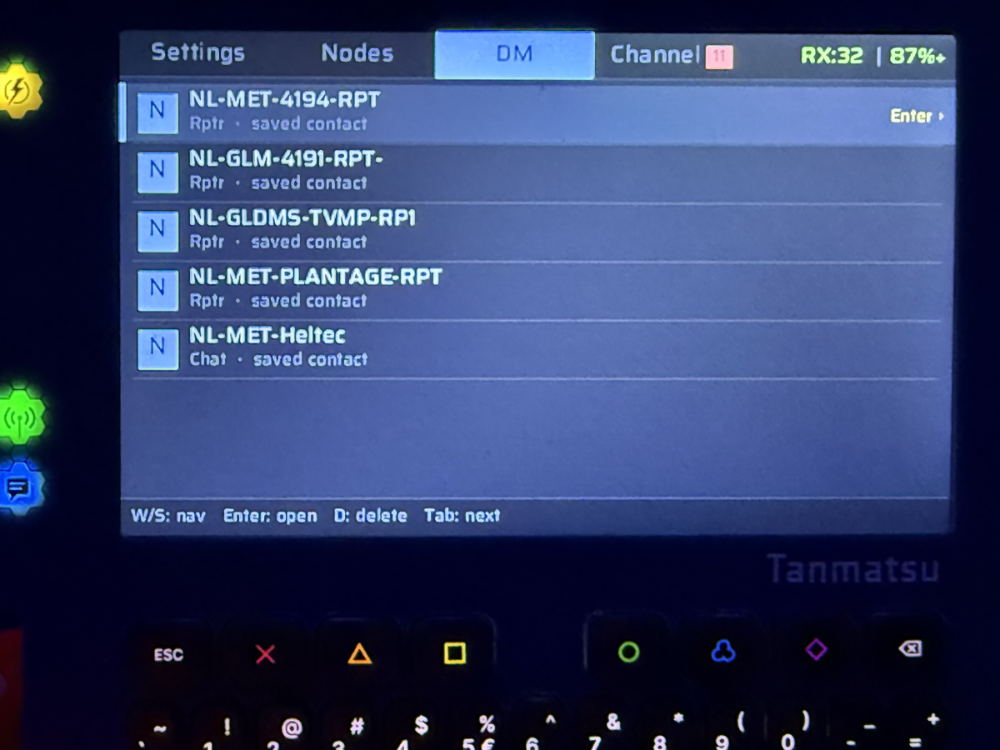

# MeshCore for Tanmatsu

A [MeshCore](https://meshcore.co.uk) LoRa mesh communication app for the
**[Tanmatsu](https://tanmatsu.cloud) badge**.

> **Compatible with the MeshCore iOS/Android app** — send and receive encrypted
> direct messages and public channel chat over LoRa, fully interoperable with
> other MeshCore nodes.

---

## Device

| | |
|---|---|
| **Hardware** | Tanmatsu badge (rev 5+) |
| **Application processor** | ESP32-P4 |
| **Radio co-processor** | ESP32-C6 |
| **Radio chip** | SX1268 (LoRa, 868 MHz EU band) |
| **Display** | 4" MIPI DSI, 800×1280 px |
| **Framework** | ESP-IDF v5.5.1 |

---

## Tabs

| Tab | Purpose |
|---|---|
| **Settings** | LoRa & identity fields (frequency, SF/BW/CR, power, presets, owner name, advert interval, region scope, …) |
| **Nodes** | Live list of heard nodes with role, RSSI/SNR, last-seen; favourites starred |
| **DM** | Inbox + per-contact end-to-end encrypted conversations, persisted to SD |
| **Channel** | Public channel chat (AES-128-ECB), persisted to SD |

## Highlights

- **Full MeshCore interoperability** with the iOS/Android app (DM send/receive
  with delivery acknowledgement, channel chat)
- **End-to-end encryption** — Ed25519 keypair generated on first boot; DMs
  encrypted with ECDH + AES-128-ECB; channel uses shared key
- **Persistent chat history** on microSD (AES-CBC encrypted, self-heals on
  identity change)
- **Multi-channel** — public channel + user-added `#channels`, picker UI
  with add/delete, brute-force MAC verify on RX, region scope visible in header
- **Region scope on the wire** — `ROUTE_TYPE_TRANSPORT_FLOOD` with
  HMAC-SHA256 transport codes per upstream MeshCore (mc-radar compatible)
- **Per-message metadata** — local time, hop count, ACK state inline under
  each chat bubble
- **Unread badges** on the tab bar for missed DM / channel messages
- **Manual GPS coords** (×1e6 upstream scale) for Nodes-tab Dist column +
  advert position field
- **Twemoji-based emoji picker** — 8 base smileys, UTF-8 round-trip with
  other MeshCore clients
- **QR contact sharing** — show a QR that the mobile app can scan directly
- **Saved contacts** — favourites stay in the list even when out of range
- **Live RSSI / SNR** per heard node (requires patched `tanmatsu-radio` firmware)
- **Message LED + battery indicator** on every screen
- **Real timestamps** via SNTP; last known time persisted to NVS

For the full feature list, packet protocol, encryption details and key bindings,
see the [wiki](docs/wiki/Home.md).

---

## Screenshots

<table>
  <tr>
    <td align="center"><b>Settings</b></td>
    <td align="center"><b>DM conversation</b></td>
  </tr>
  <tr>
    <td></td>
    <td></td>
  </tr>
  <tr>
    <td align="center"><b>Nodes</b></td>
    <td align="center"><b>QR contact card</b></td>
  </tr>
  <tr>
    <td></td>
    <td></td>
  </tr>
</table>

---

## Building

Requires the Tanmatsu ESP-IDF toolchain. Clone the
[Tanmatsu template](https://github.com/Nicolai-Electronics/tanmatsu-template-pax)
first to set up `.IDF_PATH` and `.IDF_TOOLS_PATH`.

```sh
make build  DEVICE=tanmatsu       # produces build/tanmatsu/*.bin
make upload DEVICE=tanmatsu       # badgelink appfs upload — keeps the launcher
```

### Install with custom tile icon

`make upload` puts the binary in AppFS; the launcher shows a generic
"app" icon for AppFS entries. For the custom MeshCore tile icon (see
`assets/`), drop the bundle on SD instead:

```sh
SLUG=nl.cj.meshcore
BL=path/to/badgelink.sh

$BL fs mkdir   /sd/apps/$SLUG
$BL fs upload  /sd/apps/$SLUG/metadata.json  assets/metadata.json
$BL fs upload  /sd/apps/$SLUG/icon32.png     assets/icon-32.png
$BL fs upload  /sd/apps/$SLUG/meshcore.bin   build/tanmatsu/application.bin
```

The launcher's `create_list_of_apps_from_directory` reads `metadata.json`,
loads the 32×32 PNG into the tile, and registers `meshcore.bin` as the
executable. Same bundle is the artifact for a future appstore upload.

Full toolchain setup, partition layout, launcher patches, and C6 radio
firmware flashing are documented in
[Build / Deploy](docs/wiki/Build-Deploy.md).

---

## Documentation

| Page | About |
|---|---|
| [Architecture](docs/wiki/Architecture.md) | Modules under `main/` and how they interact |
| [MeshCore protocol](docs/wiki/MeshCore-Protocol.md) | Packet types, ADVERT/DM/Channel/PATH, encryption, ACK, SNTP |
| [UI / UX](docs/wiki/UI-UX.md) | Tabs, key bindings, edit-mode state machine, QR overlay |
| [Settings / NVS](docs/wiki/Settings-NVS.md) | Persistent keys, defaults, ranges, presets |
| [SD card layout](docs/wiki/SD-Card-Layout.md) | `/sd/meshcore/`, encryption, self-heal |
| [C6 radio](docs/wiki/C6-Radio.md) | `lora_rpc`, RSSI/SNR patches, firmware update workflow |
| [Build / Deploy](docs/wiki/Build-Deploy.md) | IDF env, badgelink, launcher dependency, partition layout |

---

## Development write-up

Read about the development journey and lessons learned on Medium:
[Building a MeshCore Client on the Tanmatsu Badge](https://medium.com/@cjvansoest/building-a-meshcore-client-on-the-tanmatsu-badge-cfc46f02227f)

---

## License

MIT — see [LICENSE](LICENSE).

Developed by **CJ van Soest** with **[Claude AI](https://claude.ai)** (Anthropic)
as AI co-author. Claude assisted with protocol reverse engineering, cryptography
implementation, and UI development.

### Third-party components

| Component | Author | License |
|---|---|---|
| `qrcodegen.{c,h}` | Project Nayuki | MIT |
| `ed25519.{c,h}` | NaCl/SUPERCOP ref10 (D.J. Bernstein et al.) + ESP32 adaptation | Public domain + MIT |
| `meshcore/` | Scott Powell / rippleradios.com, Nicolai Electronics | MIT |
| Badge BSP & template | Nicolai Electronics | MIT / CC0 |
