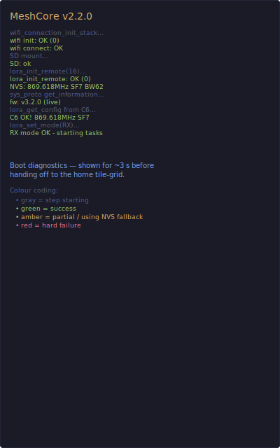
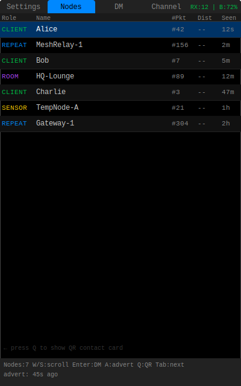
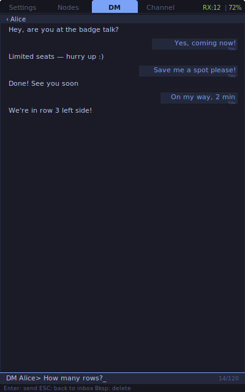
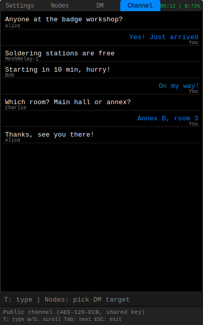
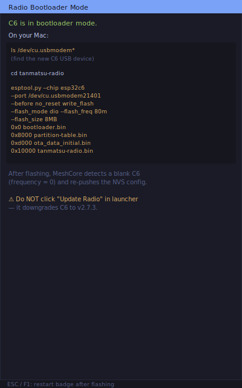

# MeshCore for Tanmatsu

A [MeshCore](https://meshcore.co.uk) LoRa mesh communication app for the
**[Tanmatsu](https://tanmatsu.cloud) badge**.

> **Compatible with the MeshCore iOS/Android app** — send and receive encrypted
> direct messages and public channel chat over LoRa, fully interoperable with
> other MeshCore nodes.

---

## Device

| | |
|---|---|
| **Hardware** | Tanmatsu badge (rev 5+) |
| **Application processor** | ESP32-P4 |
| **Radio co-processor** | ESP32-C6 |
| **Radio chip** | SX1268 (LoRa, 868 MHz EU band) |
| **Display** | 4" MIPI DSI, 800×1280 px |
| **Framework** | ESP-IDF v5.5.1 |

The Tanmatsu is an open-source badge developed by
[Nicolai Electronics](https://tanmatsu.cloud). More information and hardware
schematics are available on the Tanmatsu documentation site.

---

## Features

### Tabs

| Tab | Description |
|---|---|
| **Settings** | 14 LoRa & identity fields; stored in NVS and synced to C6 (frequency, SF/BW/CR, TX power, sync word, preamble, advert interval, presets, role, path hash size, region scope, owner & advert names) |
| **Nodes** | Live list of heard MeshCore nodes — role, name, RSSI/SNR, packet count, last-seen; favourites are starred; press L to filter by role |
| **DM** | Inbox of conversations + per-contact end-to-end encrypted thread; persisted to SD card |
| **Channel** | Public channel chat (AES-128-ECB, shared channel key); persisted to SD card |

### Highlights

- **Full MeshCore interoperability** — compatible with MeshCore iOS/Android app
  (confirmed working: DM send/receive, delivered acknowledgement, channel chat)
- **End-to-end encryption** — Ed25519 keypair generated on first boot, stored
  in NVS; DMs encrypted with ECDH (Ed25519 → Curve25519) + AES-128-ECB
- **Persistent chat history** — DMs and channel messages are stored on the
  microSD card under `/sd/meshcore/`, AES-CBC encrypted with a key derived
  from the identity private key. Self-heals on identity change: unreadable
  files are wiped on next load so a fresh log can be written
- **QR contact sharing** — press Q in Nodes tab to show a QR code that can be
  scanned directly by the MeshCore app to add you as a contact
- **Saved contacts** — press F on a node to mark it as a favourite (persisted
  to NVS); favourites stay in the list even when out of radio range
- **RSSI / SNR per node** — extracted from the C6 radio (requires the patched
  `tanmatsu-radio` firmware); colour coded green / amber / red by signal quality
- **Battery + RX status** — top-right of every screen
- **Message LED** — bottom-left LED on the badge lights up for incoming
  messages: green = DM, blue = channel; clears when the tab is opened
- **Real timestamps** — SNTP synchronisation via WiFi for correct message times
  on the receiving iOS/Android device; last-known time is persisted to NVS
  for boots without WiFi

### Controls

| Key | Action |
|---|---|
| Tab | Cycle through tabs |
| W / S | Scroll up / down (or adjust value in edit mode) |
| Enter | Edit a setting / open conversation / send DM target |
| ESC | Cancel edit / leave conversation / return to DM inbox |
| T | Start typing a message (DM or Channel tab) |
| A | Send advertisement (announce yourself to the mesh) |
| F | Toggle favourite contact (Nodes tab) |
| L | Cycle role filter (Nodes tab) |
| Q | Show QR code (Nodes tab) |
| D | Delete conversation (DM inbox) |
| R | Reload settings from NVS / clear channel history |
| U | Put C6 radio into bootloader mode (for firmware update) |
| F1 / Red X | Exit to launcher |

---

## Screenshots

<table>
  <tr>
    <td align="center"><b>Boot diagnostics</b></td>
    <td align="center"><b>Settings</b></td>
  </tr>
  <tr>
    <td></td>
    <td></td>
  </tr>
  <tr>
    <td align="center"><b>Nodes</b></td>
    <td align="center"><b>QR contact card</b></td>
  </tr>
  <tr>
    <td></td>
    <td></td>
  </tr>
  <tr>
    <td align="center"><b>DM conversation</b></td>
    <td align="center"><b>Public channel</b></td>
  </tr>
  <tr>
    <td></td>
    <td></td>
  </tr>
  <tr>
    <td align="center"><b>Radio bootloader (U)</b></td>
    <td></td>
  </tr>
  <tr>
    <td></td>
    <td></td>
  </tr>
</table>

---

## Code layout

The application is split into focused modules under `main/`:

| File | Responsibility |
|---|---|
| `main.c` | Entry point: boot diagnostics, BSP/SD/LoRa init, event loop |
| `render.c` / `render.h` | All drawing (Tokyo Night palette, layout constants, per-view renderers) |
| `input.c` / `input.h` | Key/navigation dispatch, edit-mode state machine |
| `settings_nvs.c` / `settings_nvs.h` | LoRa config + owner/advert name persistence to NVS, presets |
| `identity.c` / `identity.h` | Ed25519 keypair generation and storage, SNTP wiring |
| `nodes.c` / `nodes.h` | Heard-node table + role filter + display row builder |
| `contacts.c` / `contacts.h` | Saved-contact list (favourites) with NVS persistence |
| `chat.c` / `chat.h` | DM and channel ring buffers, send/receive helpers, LED notification |
| `radio.c` / `radio.h` | LoRa TX/RX tasks, advert sending, RSSI/SNR stats |
| `history.c` / `history.h` | SD-card mount, encrypted append/load, self-heal on bad records |
| `ui_state.h` / `app_config.h` | Shared enums and `extern` declarations across modules |
| `ed25519.c` / `qrcodegen.c` | Vendored cryptography and QR encoding |

---

## Development write-up

Read about the development journey and lessons learned on Medium:
[Building a MeshCore Client on the Tanmatsu Badge](https://medium.com/@cjvansoest/building-a-meshcore-client-on-the-tanmatsu-badge-cfc46f02227f)

For implementation details (architecture, protocol notes, NVS layout, SD-card
encryption, build/deploy, C6 patches) see the in-repo wiki:
[`docs/wiki/Home.md`](docs/wiki/Home.md).

---

## Building

Requires the Tanmatsu ESP-IDF toolchain. Clone the
[Tanmatsu template](https://github.com/Nicolai-Electronics/tanmatsu-template-pax)
first to set up `.IDF_PATH` and `.IDF_TOOLS_PATH`.

```sh
IDF_PATH=$(cat .IDF_PATH) IDF_TOOLS_PATH=$(cat .IDF_TOOLS_PATH) \
  bash -c 'source "$IDF_PATH/export.sh" >/dev/null 2>&1 && \
  idf.py -B build/tanmatsu build \
    -DDEVICE=tanmatsu \
    -DSDKCONFIG_DEFAULTS="sdkconfigs/general;sdkconfigs/tanmatsu" \
    -DSDKCONFIG=sdkconfig_tanmatsu \
    -DIDF_TARGET=esp32p4 \
    -DFAT=0'
```

Or use the `Makefile` wrapper that captures the above and the upload step:

```sh
make build  DEVICE=tanmatsu       # produces build/tanmatsu/*.bin
make upload DEVICE=tanmatsu       # badgelink appfs upload — keeps the launcher
```

`make upload` uses `badgelink` to push the ELF over USB into the appfs
partition, so the existing launcher and other apps remain untouched. A full
`idf.py flash` would overwrite the application partition and erase the
launcher — only use it for first-time provisioning.

---

## Technical notes

### ACK mechanism
MeshCore sends a **PATH_RETURN packet** (type `0x08`) as DM acknowledgement,
not a bare ACK. Inner payload (16 bytes, AES-128-ECB encrypted):

```
path_len=0x00 | extra_type=0x03 (ACK) | ack_crc[4] | zeros[10]
```

ACK CRC = `SHA256(timestamp[4] | flags[1] | text[n] | sender_pub[32])[0:4]`

### HMAC variants
DM decryption tries multiple HMAC variants (with/without Edwards→Montgomery
conversion, 32- and 16-byte key) for compatibility across MeshCore versions.

### Time synchronisation (SNTP)
MeshCore embeds a Unix timestamp in every outgoing message. The receiving
iOS/Android app uses this to display message times, so an accurate clock matters.

On startup the app connects to WiFi and syncs time via SNTP (`pool.ntp.org`).
The last successfully synchronised timestamp is persisted to NVS
(namespace `system`, key `last_time_s`). On subsequent boots **without WiFi**
the stored time is restored via `settimeofday()`, so timestamps remain
approximate but usable rather than reverting to 1 January 1970.

The current sync status is shown live in the **Settings tab footer**:

| Colour | Indicator | Meaning |
|---|---|---|
| Green | `SNTP: HH:MM:SS DD-MM-YYYY` | WiFi connected, clock synced |
| Yellow | `time: ~HH:MM DD-MM (NVS, approx)` | No WiFi; last known time restored from NVS |
| Red | `time: no sync — msg timestamps incorrect` | First boot without WiFi, no NVS baseline yet |

---

## Firmware compatibility

| Component | Version | Notes |
|---|---|---|
| **Tanmatsu launcher** | v0.1.2 (local patches) | Required for correct LoRa info display (Hz fix, PR #91). The local checkout also has a WiFi auto-connect patch — the upstream launcher only reconnects when NTP is enabled, which leaves MeshCore without WiFi if the user disabled NTP. |
| **C6 radio firmware** (tanmatsu-radio) | v2.12.3 + RSSI/SNR patches | Flashed manually — see below |

The launcher will show a **"mismatch firmware"** warning because it expects radio firmware v2.7.3
internally. This is cosmetic — the MeshCore app communicates with the radio library directly and
works correctly with v2.12.3. **Do not click "Update Radio"** in the launcher; it would downgrade
the C6 to v2.7.3.

### Flashing the C6 radio firmware

1. Open the MeshCore app on the Tanmatsu
2. Press **U** → C6 enters bootloader mode (WiFi LED turns blue)
3. Flash via esptool (from the `tanmatsu-radio` repo root after building):

```sh
esptool.py --chip esp32c6 --port /dev/cu.usbmodem21401 --before no_reset \
  write_flash --flash_mode dio --flash_freq 80m --flash_size 8MB \
  0x0     build/tanmatsu/bootloader/bootloader.bin \
  0x8000  build/tanmatsu/partition_table/partition-table.bin \
  0xd000  build/tanmatsu/ota_data_initial.bin \
  0x10000 build/tanmatsu/tanmatsu-radio.bin
```

After flashing, the app detects a blank C6 NVS config (`frequency = 0`) and automatically
pushes the stored LoRa settings to the C6.

---

## License

MIT — see [LICENSE](LICENSE).

Developed by **CJ van Soest** with **[Claude AI](https://claude.ai)** (Anthropic)
as AI co-author. Claude assisted with protocol reverse engineering, cryptography
implementation, and UI development.

### Third-party components

| Component | Author | License |
|---|---|---|
| `qrcodegen.{c,h}` | Project Nayuki | MIT |
| `ed25519.{c,h}` | NaCl/SUPERCOP ref10 (D.J. Bernstein et al.) + ESP32 adaptation | Public domain + MIT |
| `meshcore/` | Scott Powell / rippleradios.com, Nicolai Electronics | MIT |
| Badge BSP & template | Nicolai Electronics | MIT / CC0 |
