# MeshCore for Tanmatsu

[](https://github.com/CJvanSoest/meshcore/actions/workflows/ci.yml)

A [MeshCore](https://meshcore.co.uk) LoRa mesh communication app for the
**[Tanmatsu](https://tanmatsu.cloud) badge**.

> **Compatible with the MeshCore iOS/Android app** — send and receive encrypted
> direct messages and public channel chat over LoRa, fully interoperable with
> other MeshCore nodes.

---

## Device

| | |
|---|---|
| **Hardware** | Tanmatsu badge (rev 5+) |
| **Application processor** | ESP32-P4 |
| **Radio co-processor** | ESP32-C6 |
| **Radio chip** | SX1262 (LoRa, 868 MHz EU band) |
| **Display** | 4" MIPI DSI ST7701, native 480×800 — rendered as **800×480 landscape** (rotation 270°) |
| **Framework** | ESP-IDF v5.5.1 |

---

## Views

Boot drops you on a **tile-grid home screen** in LilyGo-Pager visual style.
Each tile opens a view; ESC walks you back to home, ESC on home returns to
the launcher.

| Tile | Opens |
|---|---|
| **Nodes** | Live list of heard nodes — role, RSSI/SNR, distance, last seen; saved contacts starred |
| **DM** | Inbox + per-contact end-to-end encrypted conversations (carries an unread badge on the tile itself) |
| **Channel** | Public channel chat (AES-128-ECB), per-channel rings, unread badge on the tile |
| **Map** | Slippy-map view: OSM tiles from SD, live GPS overlay, pan + zoom (6–14), crosshair, scale bar, Ripple/Carto/Cycle/Topo style profiles |
| **Advert** | Sends a flood advert inline + 2-second toast; stays on home |
| **Settings** | Two-level menu: tile-grid of categories (Identity / Regulatory / Radio / Network / Region & Location / **Brightness** / **Sounds**) → drill into the fields for one category. Advert config is reached via the Home → Advert tile. |
| **About** | App version, build date, author, upstream credits, MIT license, source URL |
| **QR** | Opens the "add me as contact" QR overlay rooted at home |

A persistent **Pager-style status strip** runs across every classic view —
view name + inline DM / # unread badges on the left, RX count / TX (rolling
1-hour duty cycle %) / battery on the right. Tab cycles the four classic
views (Settings → Nodes → DM → Channel) for keyboard power users.

## Highlights

- **Full MeshCore interoperability** with the iOS/Android app: encrypted DMs
  with delivery acknowledgement, and public channel chat.
- **End to end encryption** — Ed25519 identity, DMs via ECDH + AES-128-ECB,
  channels via a shared key. See [protocol](docs/MeshCore-Protocol.md).
- **Multi channel** with user added `#channels`, plus persistent chat history on
  microSD (AES-CBC, self healing on identity change).
- **Regulatory compliance helper** — per country sub-band frequency and power
  limits with off-band / over-power warnings and hard duty cycle enforcement.
- **GPS from several sources** (manual, PA1010D, USB-CDC, BLE companion, HTTPS
  `/ping`) and an on-device OSM map. See [GPS](docs/GPS-Sources.md), [Maps](docs/Maps.md).
- **On-device HTTPS** with a self generated cert and mDNS, **BLE companion
  radio**, **notification sounds** ([Sounds](docs/Sounds.md)), and a QR contact card.
- **Pager style UI** — unread badges, per-app brightness, live RSSI / SNR /
  noise floor, per-message hop and ACK metadata. See [UI](docs/UI-UX.md).

For the full feature set, protocol, encryption and key bindings, see the
[docs](docs/README.md).

---

## Installing

On a freshly-recovered Tanmatsu (flashed via `recovery.tanmatsu.cloud`):

1. After recovery, **boot into the launcher** and open **Tools → Firmware
   update**. This pulls the latest launcher and C6 radio firmware over
   the air. Recovery currently serves an older radio firmware
   (`ESP-HOSTED 2.1.0`) whose `lora_protocol` ABI predates the one
   MeshCore expects — the app will show "LoRa radio not available"
   until you run this step.
2. Install **MeshCore** from the appstore.
3. Open MeshCore. The Settings tab shows the live radio firmware
   version; nodes start arriving on the Nodes tab once the C6 receives
   adverts.

See [C6 Radio → Firmware update workflow](docs/C6-Radio.md#firmware-update-workflow)
for the long-form explanation, including custom-build flashing for
developers.

---

## Regulatory compliance

LoRa runs in licence-exempt ISM bands whose rules differ per country. Set your
**Country** in Settings and the app keeps you inside them: red warnings when the
frequency or your effective radiated power (TX power + antenna gain, as
ERP/EIRP) leaves the allowed sub-band, and **hard duty cycle enforcement** (a
rolling 1-hour airtime budget per sub-band; TX is blocked when it is spent).
30+ countries are covered across EU 868/433, US/AU/NZ 915, JP, KR, IN and RU.

> Guidance helper, **not legal advice**. You remain responsible for operating
> within your local regulations.

The full per-country sub-band, power and duty-cycle tables live in
[Settings / NVS → Regulatory compliance](docs/Settings-NVS.md#regulatory-compliance).

---

## Screenshots

Mock-ups of every view in landscape proportions (800×480), stacked vertically
so each one renders at a usable width regardless of viewport.

**Home — tile grid**
<p>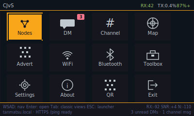</p>

**Settings — category tiles**
<p>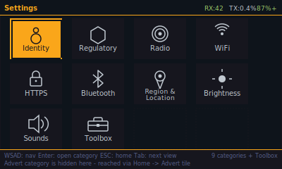</p>

**Settings → Radio (drill-in)**
<p>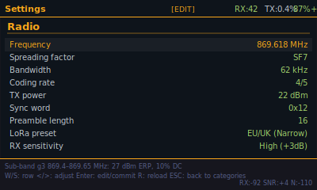</p>

**Settings → Brightness (drill-in)**
<p>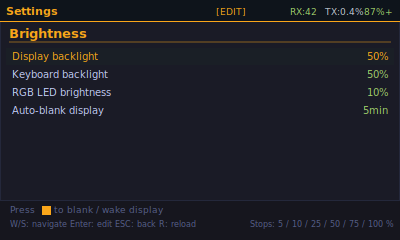</p>

**Nodes**
<p>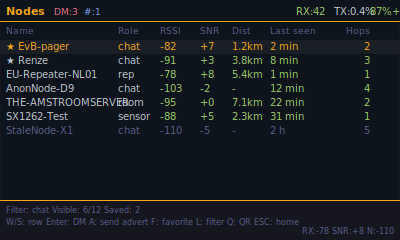</p>

**DM inbox**
<p>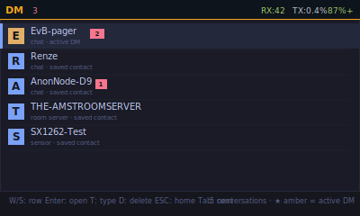</p>

**DM conversation**
<p>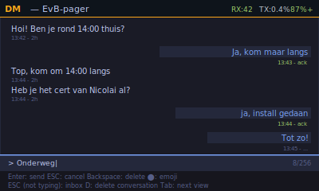</p>

**Channel**
<p>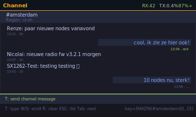</p>

**QR contact card**
<p>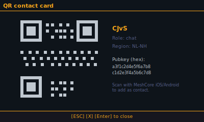</p>

**About**
<p>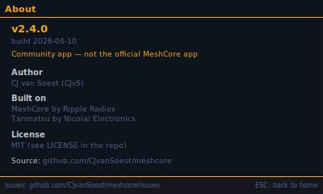</p>

**Boot diagnostics**
<p>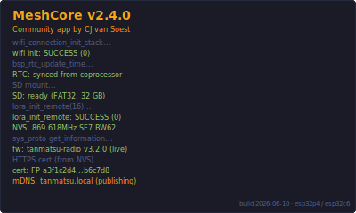</p>

---

## Building

Requires the Tanmatsu ESP-IDF toolchain. Clone the
[Tanmatsu template](https://github.com/Nicolai-Electronics/tanmatsu-template-pax)
first to set up `.IDF_PATH` and `.IDF_TOOLS_PATH`.

```sh
make build  DEVICE=tanmatsu       # produces build/tanmatsu/*.bin
make upload DEVICE=tanmatsu       # badgelink appfs upload — keeps the launcher
```

`make upload` puts the binary in AppFS with a generic launcher icon. For the
custom MeshCore tile icon, drop the `assets/` bundle on SD instead. That recipe,
plus the full toolchain setup, partition layout, launcher patches and C6 radio
firmware flashing, is in [Build / Deploy](docs/Build-Deploy.md).

---

## Contributing

The codebase is split into ESP-IDF **components** under `components/` with a
one-way dependency graph that the compiler enforces; `main/` is just `main.c`.
Pure protocol and crypto logic is host-tested off-device, and the radio is a
domain-free transport. Before changing code, read:

- **[docs/Blueprint.md](docs/Blueprint.md)** — the design rationale and the
  "how to program in this project" model.
- **[docs/Architecture.md](docs/Architecture.md)** — the enforceable rules (the
  layers, the forbidden includes, the wire-boundary discipline).
- **[docs/CONTRIBUTING.md](docs/CONTRIBUTING.md)** — the contributor checklist.
- **[`.claude/`](.claude/)** — the same model as a working handbook for AI
  pair programmers (start at `.claude/Guidelines.md`).

Every change must pass the green gate before it lands:

```sh
cd tests && make test                  # host unit + integration + crypto vectors
tests/lint/check-arch-rules.sh         # include-direction discipline
tests/lint/check-structure.sh          # file placement
tests/lint/check-test-wiring.sh        # every test is wired into the Makefile
tests/lint/check-cppcheck.sh           # static analysis
make build DEVICE=tanmatsu             # the firmware actually builds
```

---

## Documentation

| Page | About |
|---|---|
| [Blueprint](docs/Blueprint.md) | Design rationale + how to program in this project |
| [Architecture (rules)](docs/Architecture.md) | The enforced layers, forbidden includes, wire-boundary discipline |
| [Module overview](docs/Overview.md) | The `mc_*` components under `components/` and how they interact |
| [MeshCore protocol](docs/MeshCore-Protocol.md) | Packet types, ADVERT/DM/Channel/PATH, encryption, ACK |
| [UI / UX](docs/UI-UX.md) | Tabs, key bindings, edit-mode state machine, QR overlay |
| [Settings / NVS](docs/Settings-NVS.md) | Persistent keys, defaults, ranges, presets |
| [GPS sources](docs/GPS-Sources.md) | All 5 input paths, what's tested vs preview, how to wire OwnTracks / iOS Shortcuts / MeshMapper |
| [Sounds](docs/Sounds.md) | WAV format, recommended free sources, `ffmpeg` + `badgelink` setup |
| [SD card layout](docs/SD-Card-Layout.md) | `/sd/meshcore/`, encryption, self-heal |
| [C6 radio](docs/C6-Radio.md) | `lora_rpc`, RSSI/SNR patches, firmware update workflow |
| [Build / Deploy](docs/Build-Deploy.md) | IDF env, badgelink, launcher dependency, partition layout |

---

## Development write-up

Read about the development journey and lessons learned on Medium:
[Building a MeshCore Client on the Tanmatsu Badge](https://medium.com/@cjvansoest/building-a-meshcore-client-on-the-tanmatsu-badge-cfc46f02227f)

---

## Bug reports & feature requests

This is a community build of MeshCore for the Tanmatsu badge, **not the
official MeshCore iOS/Android app**. For issues, questions, or feature ideas
that are specific to this app, please open a ticket so they don't get lost in
chat threads:

→ **[github.com/CJvanSoest/meshcore/issues](https://github.com/CJvanSoest/meshcore/issues)**

If you're chatting on the MeshCore Discord and the question is specific to
the Tanmatsu app, please open a ticket here too — it makes the history
searchable for the next person hitting the same thing.

---

## License

MIT — see [LICENSE](LICENSE).

Developed by **CJ van Soest** with **[Claude AI](https://claude.ai)** (Anthropic)
as AI co-author. Claude assisted with protocol reverse engineering, cryptography
implementation, and UI development.

### Third-party components

| Component | Author | License |
|---|---|---|
| `qrcodegen.{c,h}` | Project Nayuki | MIT |
| `lodepng.{c,h}` | Lode Vandevenne | zlib |
| `ed25519.{c,h}` | NaCl/SUPERCOP ref10 (D.J. Bernstein et al.) + ESP32 adaptation | Public domain + MIT |
| `emoji_bitmaps.c` (Twemoji subset) | Twitter / jdecked | CC-BY 4.0 |
| `meshcore/` | Scott Powell / rippleradios.com, Nicolai Electronics | MIT |
| Badge BSP & template | Nicolai Electronics | MIT / CC0 |
| pax-gfx | robotman2412 / Badge.Team | MIT |
