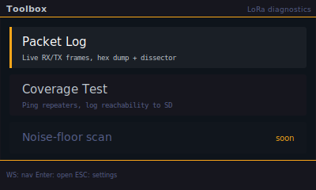
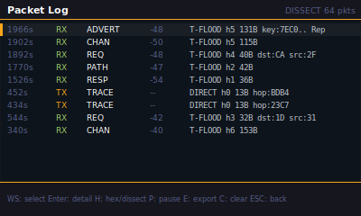
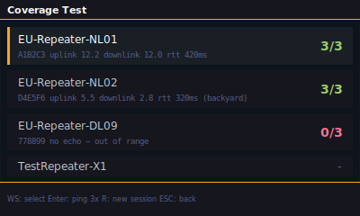

# Toolbox

The **Geeky LoRa Toolbox** (#3) is a small menu of on-badge LoRa diagnostic
tools, reached from the **Settings → Toolbox** tile. Two tools ship in v2.7.0 —
the **Packet Log** and the **Coverage Test**; tools not built yet render dimmed
with a "soon" tag.

<p></p>

`W`/`S` move between tools, `Enter` opens the focused one, the red X (F1) returns
to Settings. The launcher lives in `render_toolbox.c`; each tool is its own view.

---

## Packet Log

A live, terminal-style sniffer of every radio frame the badge sees, in both
directions, newest-first. Use it to confirm you are hearing a network, to read
what a node actually transmitted, and to capture frames for off-badge analysis.

<p></p>

### What you see

Each row is one captured frame, with five columns:

| Column | Meaning |
|---|---|
| **TS** | Capture time in seconds since boot |
| **DIR** | `RX` (green) for a received frame, `TX` (amber) for one we put on air |
| **TYPE** | Decoded payload type — `ADVERT`, `CHAN`, `TXT`, `REQ`, `RESP`, `PATH`, `TRACE`, … (or `?` if the header did not parse) |
| **RSSI** | Received signal strength in dBm (RX only; `--` on TX) |
| **DETAIL** | A one-line summary; its content depends on the mode (below) |

The header shows the current mode (`HEX` / `DISSECT`) and the total frames
captured since boot; a red **PAUSED** appears when the window is frozen. The
selected row is highlighted with an amber stripe.

Two detail modes toggle with **`H`**:

- **HEX** — the leading on-air bytes as a hex dump.
- **DISSECT** — a per-field breakdown decoded by the pure `mc_proto/diag_decode`:
  route, hop count, length, and per type the ADVERT pubkey/role/name or the
  DM destination/source hash. Public-channel (`GRP_TXT`) senders are anonymous
  by protocol design, so they show no identity.

Press **`Enter`** on a row for the full-screen detail view: every decoded field
plus the complete 32-byte public key and the raw bytes, in a monospace face so
the hex lines up. The red X closes it.

### How it works

- Frames are captured into a small mutex-protected ring in PSRAM
  (`mc_common/diag`, `DIAG_LOG_SIZE` = 64 frames, up to `DIAG_RAW_MAX` = 176
  bytes each), tapped straight off the transport in `mc_radio` — the RX task and
  the `radio_tx_message` tail. Capture happens **before** the RX dedup, so flood
  retransmits stay visible to the sniffer.
- The ring keeps filling regardless of the UI. **`P`** (pause) only freezes the
  displayed window so you can read and scroll a stable view; capture continues
  underneath. **`C`** clears the ring.
- Each visible frame is dissected once at snapshot time, so the render loop never
  re-decodes a row it already drew. The dissect runs on the captured prefix
  (176 B), so a longer frame shows a display-only truncation; the header fields
  stay complete.

### Export to SD (the `E` key)

**`E`** dumps the whole ring to a plaintext CSV
`/sd/meshcore/log/pkt_<unix>.csv` (the filename timestamp comes from the C6
RTC), newest frame first, and raises a toast with the path and frame count. The
columns are:

```
ts_ms,dir,type,route,rssi_dbm,snr_db,len,raw_hex
```

`rssi_dbm` / `snr_db` are blank on TX rows and on RX frames with no measurement;
`raw_hex` is the captured leading bytes as lower-case hex. Row formatting is the
pure, host-tested `diag_csv_row()` (`mc_proto/diag_decode`); the UI side
(`render_toolbox_log.c`) writes the file, a no-op when no card is mounted. The
rows carry on-air frame bytes only — no decrypted message content. Pull a file
off with `badgelink fs download /sd/meshcore/log/pkt_<unix>.csv`.

> Export lives on **`E`** because **`S`** is the scroll-down key in this view.
> Full key row: `WS` select · `Enter` detail · `H` hex/dissect · `P` pause ·
> `E` export · `C` clear · red X back.

---

## Coverage Test

Field-test repeater reachability from different positions: pick a discovered
repeater, auto-ping it 3x, classify the result (green = all OK / orange =
partial / red = fail), and log every attempt (GPS-stamped) to one file on the SD
card per session. This mirrors the MeshMapper wardriving workflow, but on-badge
and offline. A later sub-phase adds a clean map view that drops a colour-coded
marker per tested position.

<p></p>

**Sub-phase 2a (list + auto-ping + SD log) shipped in v2.7.0** and is
hardware-verified against real repeaters (own repeater 3/3 reachable with correct
uplink/downlink SNR + RTT; out-of-range repeaters correctly report unreachable).
Sub-phase 2b (the coverage map) is still design only. Implemented in 2a:
`mc_domain/coverage.{c,h}` (result model + TRACE-tag matcher + SD CSV + repeater
collector), the ping controller `coverage_ping_start` + `send_trace` in `mc_rx`
with a `rx_handle_trace` hook, and `VIEW_TOOLBOX_COVERAGE`
(`render_toolbox_coverage.c` + input).

### What you see

One card per discovered repeater (`role == REPEATER`), showing the name, the
3-byte pubkey prefix, and a right-aligned **acks/attempts** counter coloured by
result. `W`/`S` move the cursor, `Enter` pings the selected repeater 3x, `R`
starts a new session, the red X returns to the launcher. The header shows
`testing…` while a ping run is in flight.

### Reachability primitive: TRACE

The ping is an upstream MeshCore **TRACE** (`PAYLOAD_TYPE_TRACE = 0x09`), not a
DM. A repeater only ACKs a DM (TXT_MSG) from a logged-in admin client
(`examples/simple_repeater/MyMesh.cpp`), so a plain DM+ACK never turns green
against a real repeater (see issue #25). TRACE is handled by every role in the
base `Mesh`, so it is the correct probe.

- `send_trace(target_pub, tag)` (`mc_rx`) builds a TRACE: payload
  `tag[4] | auth[4] | flags[1] | repeater_hash[...]`, DIRECT-routed, on-wire
  `path_length = 0` (the hop hash rides in the payload, per upstream
  `Mesh::sendDirect`). The per-hop SNR path accumulates as it travels.
- The repeater stamps its RX SNR into the path field and rebroadcasts; the
  returning frame carries our random `tag`, so `rx_handle_trace` recognises it
  and calls `coverage_note_tag(tag, uplink_snr, downlink_snr)`.
- `uplink_snr` = the SNR the repeater measured receiving from us (path[0]);
  `downlink_snr` = our SNR of the returning frame. Both go in the CSV.

TRACE is exempted from the RX dedup (`radio.c`): its payload is constant while
only the SNR path changes, so the payload-fingerprint dedup would otherwise drop
the return. The wire payload layout is the pure, host-tested `mc_proto/trace.{c,h}`
(`test_trace`); the TRACE envelope reuses the normal `meshcore_serialize`.

### Wire gotchas (why the probe got no echo, fixed in v2.7.0)

Three sequential bugs each silently killed the round-trip. They are non-obvious
and cost real debugging, so they are recorded here. The fixed behaviour is the
*only* thing that round-trips against an upstream repeater:

1. **A TRACE must stay direct-routed.** `apply_region_scope` (`radio.c`) used to
   rewrite every scoped TX to `TRANSPORT_FLOOD`, including the TRACE. Upstream
   only processes a TRACE on a direct route (`Mesh::onRecvPacket` gates on
   `isRouteDirect()`) and explicitly refuses to flood one (`Mesh::sendFlood`:
   "TRACE type not supported"), so a flooded TRACE is dropped by every repeater.
2. **A TRACE is sent plain `DIRECT`, unscoped — no transport codes.** Upstream's
   companion sends it via `CMD_SEND_TRACE_PATH → Mesh::sendDirect` with no
   transport codes; repeaters region-gate *flood* packets only
   (`simple_repeater::allowPacketForward` checks the region solely under
   `isRouteFlood()`), so a direct trace is forwarded regardless of scope.
   `apply_region_scope` therefore skips TRACE entirely.
3. **The path-control byte's size must be 1, not the hop-hash size.** A TRACE's
   wire path field is the per-hop SNR accumulator — one *byte* per hop — so its
   path-control size bits must be 0 (control byte `0x00`). The hop-hash size
   (2 bytes for NL) rides in the payload `flags` (`path_sz`), not here. Encoding
   `bytes_per_hop = hash_size` produced control byte `0x40`; a repeater then read
   `path_len = 0x40 = 64`, computed `offset = 64 << path_sz` past the hop list,
   and hit the "trace reached end of path" branch (`onTraceRecv`) instead of
   appending its SNR and retransmitting → no echo. `send_trace` sets
   `bytes_per_hop = 1`.

Net: the probe is `ROUTE_TYPE_DIRECT`, no transport codes, path-control `0x00`,
hop hash = the repeater's 2-byte pubkey prefix in the payload. See issue #25.

### Flow + SD log

1. On select, a background FreeRTOS task loops 3×: pick a random tag →
   `send_trace` → arm the tag → wait ~8 s for the return → record reachable/SNR
   → `vTaskDelay(10 s)`. The UI never blocks.
2. Classify: green = 3/3, orange = 1–2/3, red = 0/3.
3. Append one CSV row per attempt to a single session file
   `/sd/meshcore/coverage/cov_<unix>.csv`, columns:
   `ts_unix, repeater, pubkey, lat_e6, lon_e6, attempt, reachable, rtt_ms,
   uplink_snr_db, downlink_snr_db`. GPS comes from `gps_live_lat_e6/lon_e6`
   guarded by `gps_live_valid` (captured when the run starts, so all 3 attempts
   share the session-start fix; blank when there is no fix). One file per area
   test = all positions land in the same log.

### Coverage map (sub-phase 2b — later)

Kept **separate** from the existing `VIEW_MAP` (which draws node/repeater pins),
so the coverage map stays clean:

- Dedicated `VIEW_COVERAGE_MAP` with its **own** centre/zoom state (don't mutate
  `map_center_*` / `map_zoom`), zoom locked to 15–16. Reuse the tile cache +
  loader for the base raster, but render **only** coverage markers.
- Markers: small in-RAM array of `{lat_e6, lon_e6, result}` (also persisted in
  the CSV so a session can be replayed), drawn as a colour-coded dot.
- "Save test area as one PNG": render the bounding box of all markers offscreen
  and encode to `/sd/meshcore/coverage/<session>.png`. Note: the vendored
  lodepng is **decoder-only** today (`-DLODEPNG_NO_COMPILE_ENCODER`), so this
  needs the encoder re-enabled (costs flash) or an uncompressed BMP.

### Out of scope

- Noise-floor scan (#3c) — needs C6 radio firmware (RSSI sweep).
- Precise RTT: the logged `rtt_ms` is the measured TRACE round-trip (send →
  matched return), not a calibrated link metric.

Refs #3.
