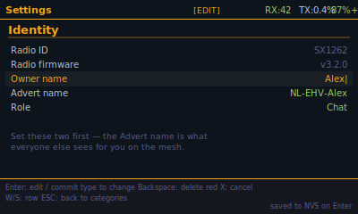

# Getting started

First time with MeshCore on the Tanmatsu? This page walks you from a fresh
install to being visible on the mesh. It takes about two minutes.

When the app starts it lands on the **home** screen: a 4×3 grid of tiles. Move
the focus with **WSAD** or the **D-pad** and press **Enter** to open a tile. The
**red X** always steps back; **ESC** on the home screen returns to the launcher.

## Do this first: set your Owner name and Advert name

> **This is the single most important step.** Your **Advert name** is what every
> other person on the mesh sees for you — in their Nodes list, in adverts, and as
> the sender of your channel messages. A fresh badge has no name set, so until you
> set one you show up as blank or unidentifiable, and nobody can tell who you are.
> Setting these two fields first prevents the large majority of "who is this?" and
> "why can't people see me?" questions.

- **Owner name** — your own local identity, shown in the home header. Use whatever
  you like (your name, handle, or callsign).
- **Advert name** — the public name broadcast to the mesh. Keep it **short**; the
  common convention on the Dutch network is a region prefix, e.g. `NL-EHV-Alex`
  (country-region-name). This is the name people will actually see.

### Steps

1. From **home**, open **Settings** (focus the Settings tile, press **Enter**).
2. Open the **Identity** category (press **Enter** on the Identity tile).
3. Select **Owner name**, press **Enter**, type your name, press **Enter** to save.
4. Select **Advert name**, press **Enter**, type the name others will see, press
   **Enter** to save.
5. Leave **Role** on **Chat** unless you are deliberately running a repeater or
   room server.

### Editing keys

| Key | Action |
|---|---|
| **Enter** | Enter edit mode on a field; press again to **save** (written to NVS) |
| Keyboard | Type to change the value; **Backspace** deletes |
| **W / S** or D-pad up/down | Move between rows |
| **red X** | Cancel the edit / step back a level |
| **ESC** | Back to the category grid (from a drilldown) |

The amber `[EDIT]` marker in the top-right and the amber row highlight tell you a
field is in edit mode. Your changes persist across restarts.

## Next: get on the air

The category grid is where the rest of the setup lives. Focus a tile and press
**Enter** to drill in.

1. **Regulatory → Country** — set your country so the radio stays within the
   local frequency and power limits.
2. **Radio → LoRa preset** — match the network you want to join. On the Dutch
   network that is **EU/UK (Narrow)**: SF7, BW 62.5 kHz, CR 4/5, 869.618 MHz. If
   your local mesh uses different settings, adjust the individual radio fields to
   match — every node on a mesh must share the same radio parameters to hear each
   other.
3. **Region & Location → Region scope** — set your regional scope (e.g.
   `nl-noord-brabant`) so your channel messages are tagged for your area.
4. **Announce yourself** — from home, open the **Advert** tile and choose **Send
   flood now**. Your advert (with the name you just set) goes out so other nodes
   add you to their list.

## Now you can

- **Nodes** — see who else is on the mesh, with signal and distance.
- **DM** — end-to-end encrypted direct messages to a contact.
- **Channel** — join the public channel or add community/private channels.
- **QR** — show your contact card so someone can add you (`meshcore://contact/add`).
- **Map** — plot heard nodes on offline map tiles.
- **Toolbox** — packet log and repeater coverage test for diagnostics.

## See also

- [UI-UX.md](../features/UI-UX.md) — every view, the key map, and the palettes
- [GPS-Sources.md](../features/GPS-Sources.md) — the four ways to give the badge a position
- [Screenshots.md](../features/Screenshots.md) — mock-ups of every screen
